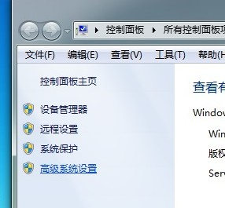
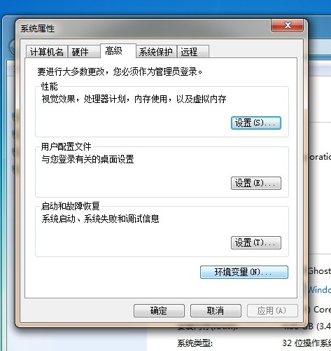
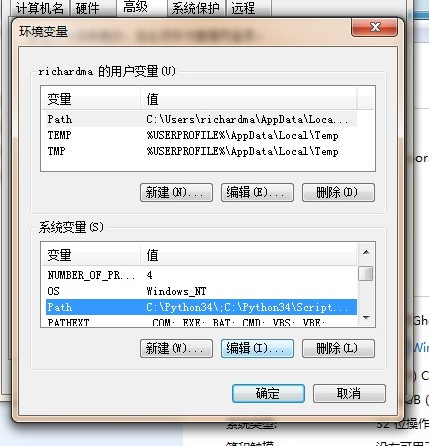
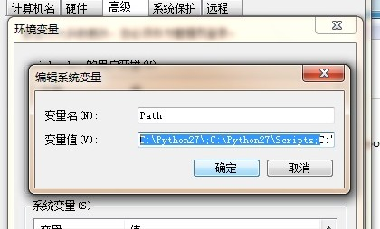
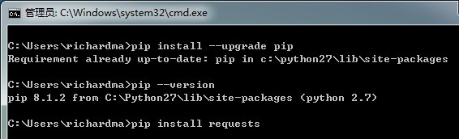
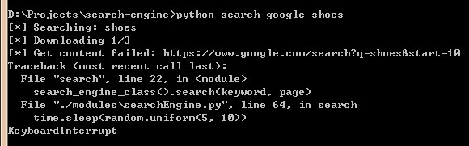

# Google Crawler

## 安装

### 安装python2.7

如果已经安装了python则可跳过此步骤。

请到这个链接下载：[Python Windows](https://www.python.org/downloads/release/python-2711/)

注意根据自己系统选择32位和64位版本。

### 设置环境变量

#### 打开我的电脑->属性

#### 选择高级系统设置

#### 高级选项卡->环境变量

#### 系统变量栏->Path

#### 将C:\Python27\;C:\Python27\Scripts;加入变量值

### 升级pip并安装requests库

#### 升级pip并安装requests库

* pip install --upgrade pip
* pip install requests

## 使用

### 图形化界面

#### Windows

*在keywords文件中每行一条关键字
*可直接双击search.bat文件进行搜索
*可直接双击schedule.bat文件进行定时执行

### 工作目录

先cd到程序所在目录（这里程序所在目录为D:\Projects\search_engine\)

### 命令格式

[python] search (search_engine) (keyword)

例如搜索关键字shoes:

[python] search googleshopping shoes

### 搜索过程截图

